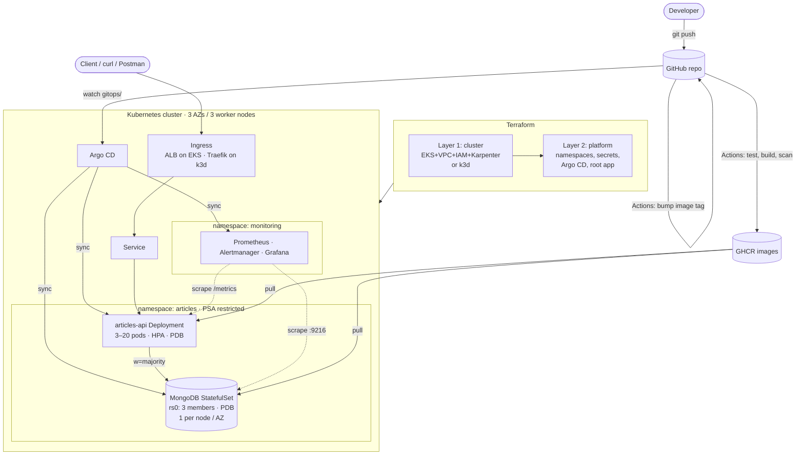

# Articles Platform — FastAPI + MongoDB on Kubernetes

A small Articles REST API. The focus is on how it runs in production: Terraform provisions the cluster, Helm packages the workloads, Argo CD deploys them from git, and the design removes single points of failure, adds observability, and is secure by default.

| Area | What's implemented |
|---|---|
| **Application** | FastAPI + PyMongo async client, CRUD on `/articles`, `/healthz` `/readyz` `/metrics`, unit tests |
| **Containers** | Multi-stage, non-root API image; MongoDB 8.0 image with a bundled replica-set bootstrap script. Both are built multi-arch and pushed to **GHCR** by CI |
| **Cluster (Terraform)** | **Option A:** AWS **EKS** (VPC across 3 AZs, managed node group, Pod Identity, **Karpenter**, AWS LB Controller, EBS CSI + gp3, ECR, KMS). **Option B:** local **k3d** (1 control-plane + 3 worker nodes; 3 control-plane optional) |
| **HA / no SPOF** | API ×3+ with HPA, **3-member MongoDB replica set** as a StatefulSet, PDBs, anti-affinity + zone spread, liveness/readiness/startup probes everywhere, HA control plane |
| **Deployment** | Two Helm charts (`charts/articles-api`, `charts/mongodb`), deployed by **Argo CD** (app-of-apps) |
| **Observability** | kube-prometheus-stack (Prometheus, Alertmanager, Grafana, node-exporter, kube-state-metrics), ServiceMonitors, alert rules and a Grafana dashboard for the API, MongoDB exporter |
| **Security** | Restricted Pod Security Standard, NetworkPolicies, non-root read-only containers, secrets generated by Terraform (never in git), KMS-encrypted secrets, IMDSv2, SHA-pinned CI actions, SBOM/provenance and a Trivy scan |
| **NTP** | Ansible `chrony` role for self-managed hosts (EKS uses AL2023 EKS-optimised AMIs, which already sync time via Amazon Time Sync) |

---

## Table of contents
1. [Architecture overview](#1-architecture-overview)
2. [Repository layout](#2-repository-layout)
3. [Prerequisites](#3-prerequisites)
4. [Cluster setup (Terraform)](#4-cluster-setup-terraform)
5. [Application deployment (Helm / Argo CD)](#5-application-deployment-helm--argo-cd)
6. [Accessing and testing the API](#6-accessing-and-testing-the-api)
7. [Eliminating single points of failure](#7-eliminating-single-points-of-failure)
8. [Observability](#8-observability)
9. [Security](#9-security)
10. [Scalability](#10-scalability)
11. [NTP on worker nodes (Ansible)](#11-ntp-on-worker-nodes-ansible)
12. [CI/CD](#12-cicd)
13. [Design decisions](#13-design-decisions)
14. [What's Pending](#whats-pending)

---

## 1. Architecture overview



**Request path:** client → load balancer (AWS ALB, or the k3d load balancer on `localhost:8080`) → Ingress → `articles-api` Service → one of ≥3 API pods → MongoDB replica set. Writes go to the primary with `w=majority`, so they survive the loss of any one member. Reads prefer the primary.

**Control path:** Terraform builds the cluster (layer 1), then installs Argo CD plus one root `Application` (layer 2). From then on, **git is the source of truth**: Argo CD syncs `gitops/apps/<env>/`, which deploys kube-prometheus-stack, MongoDB and the API. CI deploys a new version by committing its image tag to `gitops/values/common/images.yaml`.

### Components

| Component | Where | Notes |
|---|---|---|
| `articles-api` | `app/`, `charts/articles-api` | FastAPI on uvicorn, port 8080, UID 10001, read-only root filesystem |
| MongoDB 8.0 replica set | `images/mongodb`, `charts/mongodb` | Keyfile auth between members; the `rs-init` sidecar bootstraps the replica set and users; `mongodb_exporter` sidecar |
| Argo CD | installed by `terraform/modules/platform` | App-of-apps; runs HA on EKS |
| kube-prometheus-stack | `gitops/apps/*/kube-prometheus-stack.yaml` | Discovers ServiceMonitors cluster-wide |
| AWS LB Controller, Karpenter, EBS CSI, metrics-server | `terraform/environments/aws/1-cluster` | EKS only; k3s ships Traefik, local-path storage and metrics-server |

---

## 2. Repository layout

```
.
├── app/                         FastAPI service (src/, tests/, Dockerfile)
├── images/mongodb/              MongoDB image = mongo:8.0 + rs-init.sh
├── charts/
│   ├── articles-api/            Deployment, Service, Ingress, HPA, PDB, NetworkPolicy,
│   │                            ServiceMonitor, PrometheusRule, Grafana dashboard
│   └── mongodb/                 StatefulSet (3), headless Service, PDB, NetworkPolicy,
│                                Secret (optional), exporter, ServiceMonitor, alerts
├── gitops/
│   ├── apps/{local,aws}/        Argo CD Applications (watched by the root app)
│   └── values/{common,local,aws}/  Helm values per environment (+ CI-managed image tag)
├── terraform/
│   ├── modules/
│   │   ├── k3d-cluster/         HA k3d cluster via rendered k3d config
│   │   └── platform/            namespaces, generated secrets, Argo CD, root app
│   └── environments/
│       ├── local/{1-cluster,2-platform}
│       └── aws/
│           ├── 1-cluster/       plain aws_* resources, one file per concern:
│           │                    provider.tf variables.tf vpc.tf eks.tf nodegroup.tf
│           │                    addons.tf pod_identity.tf karpenter.tf k8s_addons.tf
│           │                    ecr.tf outputs.tf policies/
│           └── 2-platform/
├── ansible/                     chrony (NTP) role + playbook
├── scripts/                     bootstrap-local.{sh,ps1}, test-api.{sh,ps1}, destroy-local.sh
├── bootstrap-local.bat          Windows one-click local environment
├── docker-compose.yml           local dev loop (API + single-node replica set)
└── .github/workflows/ci.yml     test → validate → build/push → scan → GitOps bump
```

---

## 3. Prerequisites

| Tool | Version | Needed for |
|---|---|---|
| Docker (Docker Desktop, or Engine on Linux / WSL2) | 24+ | k3d, image builds |
| Terraform (or OpenTofu) | ≥ 1.10 | all infrastructure |
| kubectl | ≥ 1.33 | cluster access |
| k3d | ≥ 5.7 (config written for v5.9) | local option |
| Helm | ≥ 3.14 | optional: manual installs and `helm template` |
| AWS CLI v2 | latest | EKS option (`aws eks get-token`) |
| Ansible | ≥ 2.15 | NTP role |
| jq | any | optional: prettier `test-api.sh` output |

**Local option:** about 8 GB of RAM for Docker (6 k3s nodes plus the monitoring stack). On Windows, run the scripts from **WSL2**.

**AWS option:** an AWS account and an IAM principal allowed to create VPC, EKS, IAM, KMS, SQS, EventBridge, ECR and EC2 resources. Expected cost is roughly **$0.10/h for the EKS control plane, plus 3× t3.large, 1–3 NAT gateways and an ALB** while it runs. Destroy it when you're done.

**Container images:** CI publishes `ghcr.io/kraushan1997/articles-api` and `ghcr.io/kraushan1997/mongodb`. GHCR makes new packages **private** by default. After the first CI run, either set both packages to **Public** (GitHub → Packages → *package* → Settings → Change visibility), or create an image pull secret and set `imagePullSecrets` in the values.

---

## 4. Cluster setup (Terraform)

Terraform is split into **two layers per environment**, each with its own state:

1. `1-cluster`: the cluster and its cloud dependencies.
2. `2-platform`: what goes *inside* the cluster before GitOps takes over.

The split means the Kubernetes and Helm providers always have a real cluster to talk to at plan time. It also lets the in-cluster layer be rebuilt without touching the cluster.

### Option B — local k3d (quickest)

**Windows (no WSL needed):** start Docker Desktop, then double-click **`bootstrap-local.bat`** in the repo root. It uses `k3d`, `kubectl` and `terraform` from your PATH, or downloads them into `.tools\`. Then it creates the cluster, installs Argo CD, waits for the sync and runs the CRUD test (`test-api.bat` re-runs just the test).

**Linux / macOS / WSL:**

```bash
# everything in one go (cluster → Argo CD → wait for sync → CRUD test)
./scripts/bootstrap-local.sh            # TF=tofu ./scripts/bootstrap-local.sh for OpenTofu
```

or step by step:

```bash
cd terraform/environments/local/1-cluster
terraform init && terraform apply        # k3d: 1 server + 3 agents in zone-a/b/c (-var servers=3 for HA etcd)
kubectl get nodes -L topology.kubernetes.io/zone

cd ../2-platform
terraform init && terraform apply        # namespaces, mongodb-auth + grafana-admin secrets, Argo CD, root app
kubectl -n argocd get applications -w    # wait for Synced/Healthy
```

What the local cluster looks like:
- **1 server node** by default, tainted so application pods stay off it. `-var servers=3` gives an HA embedded-etcd control plane, but multi-server k3d clusters on Docker Desktop often lose etcd quorum after a Docker or Windows restart (the node containers get new IPs), so 1 is the reliable laptop default. The EKS stack has a multi-AZ managed control plane either way.
- **3 agent nodes**, each labelled with its own `topology.kubernetes.io/zone`. That way the zone-spread rules behave the same as on a 3-AZ cloud cluster.
- Host ports `8080→80` and `8443→443` lead to the Traefik ingress. Kubernetes Secrets are encrypted at rest (`--secrets-encryption`).

Tear down: `./scripts/destroy-local.sh`

### Option A — AWS EKS

The AWS stack uses plain `aws_*` resources (no community modules), with one file per concern:

| File | What's in it |
|---|---|
| `provider.tf` | provider versions, `default_tags`, and helm/kubectl auth via `aws eks get-token`. **No credentials in code** |
| `variables.tf` | `aws_region`, `vpc_cidr`, `az_count`, `eks_version`, `eks_cluster_name`, `api_allowed_cidrs`, sizes, versions |
| `vpc.tf` | VPC, public and private subnets per AZ (`count`), IGW, NAT + EIP per AZ, route tables, subnet discovery tags |
| `eks.tf` | cluster IAM role, KMS key, log group, `aws_eks_cluster`, OIDC provider |
| `nodegroup.tf` | node IAM role + policies, launch template (IMDSv2, gp3), `aws_eks_node_group` |
| `addons.tf` | managed add-ons: vpc-cni, kube-proxy, pod-identity-agent, coredns, metrics-server, EBS CSI |
| `pod_identity.tf` | IAM roles for the EBS CSI driver and the AWS Load Balancer Controller (EKS Pod Identity) |
| `karpenter.tf` | node role + access entry, SQS + EventBridge, controller role + policy, Helm release, EC2NodeClass, NodePool |
| `k8s_addons.tf` | gp3 StorageClass, AWS Load Balancer Controller |
| `ecr.tf` | ECR repositories + lifecycle policy |

```bash
aws configure                                     # credentials live in ~/.aws, never in .tf files
cd terraform/environments/aws/1-cluster
cp terraform.tfvars.example terraform.tfvars      # set region, your IP in api_allowed_cidrs
terraform init
terraform apply                                   # ~15-20 min
$(terraform output -raw configure_kubectl)        # aws eks update-kubeconfig ...

cd ../2-platform
terraform init
terraform apply
kubectl -n argocd get applications -w
```

What `1-cluster` creates:

| Concern | Resources |
|---|---|
| Networking | VPC `10.0.0.0/16`, 3 private /20 + 3 public /24 subnets across 3 AZs, a NAT gateway per AZ (`single_nat_gateway=true` for a cheaper demo), subnet tags for ELB and Karpenter discovery |
| Cluster | EKS 1.35, private + CIDR-restricted public endpoint, access entries (`API` mode), KMS envelope encryption for Secrets, API/audit/authenticator logs |
| Node groups | `system` managed node group (AL2023, 3–6 × t3.large, one per AZ, IMDSv2, encrypted gp3) for CoreDNS, Karpenter and Argo CD |
| Node autoscaling | **Karpenter** 1.14 (Pod Identity role, node role, SQS interruption queue + EventBridge rules). `EC2NodeClass` + `NodePool`: spot and on-demand, c/m/r/t instance families gen > 4, 3 AZs, consolidation, a 64-vCPU cap |
| IAM & service accounts | EKS Pod Identity roles for the AWS Load Balancer Controller, the EBS CSI driver and Karpenter (each controller gets only its own permissions); OIDC provider kept for IRSA-only charts |
| Add-ons | vpc-cni (with NetworkPolicy enforcement), coredns, kube-proxy, pod-identity-agent, aws-ebs-csi-driver, metrics-server |
| Load balancing | AWS Load Balancer Controller (2 replicas + PDB). The API Ingress becomes an internet-facing ALB with IP targets |
| Storage | default `gp3` StorageClass (encrypted, `WaitForFirstConsumer`, `Retain`) |
| Registry | ECR repos `articles-api`, `mongodb` (immutable tags, scan-on-push, KMS, lifecycle policy). CI uses GHCR by default, and ECR is ready if you'd rather keep images in AWS |

Remote state: uncomment the `backend "s3"` block (S3 with native lockfile) once a state bucket exists.

Tear down: `terraform destroy` in `2-platform`, then in `1-cluster`.

---

## 5. Application deployment (Helm / Argo CD)

### GitOps with Argo CD (default path)

`terraform/modules/platform` installs Argo CD and a root Application that points at `gitops/apps/<env>`:

| Application | Sync wave | Source |
|---|---|---|
| `kube-prometheus-stack` | 0 | prometheus-community chart 91.5.0 + `gitops/values/*/kube-prometheus-stack.yaml` (multi-source `$values`) |
| `mongodb` | 1 | `charts/mongodb` + `gitops/values/{common,<env>}/mongodb.yaml` |
| `articles-api` | 2 | `charts/articles-api` + `gitops/values/{common,<env>}/articles-api.yaml` + `common/images.yaml` |

Every app has automated sync with **prune + self-heal**, retries with backoff, and `SkipDryRunOnMissingResource`. The last one lets the first sync converge while the Prometheus CRDs are still being installed.

To ship a change, merge to `main`. CI builds `sha-<commit>` images and commits the tag to `gitops/values/common/images.yaml`. Argo CD then performs a zero-downtime rolling update (`maxUnavailable: 0`, readiness-gated).

```bash
# Argo CD UI
kubectl -n argocd port-forward svc/argocd-server 8081:80      # http://localhost:8081
kubectl -n argocd get secret argocd-initial-admin-secret -o jsonpath='{.data.password}' | base64 -d
```

### Plain Helm (without Argo CD)

```bash
kubectl create namespace articles
# chart-managed secret (for a quick manual install; Terraform generates these in the GitOps path)
helm upgrade --install mongodb charts/mongodb -n articles \
  --set auth.rootPassword=$(openssl rand -hex 16) \
  --set auth.appPassword=$(openssl rand -hex 16) \
  --set auth.metricsPassword=$(openssl rand -hex 16) \
  --set auth.keyfile=$(openssl rand -hex 128) \
  --set metrics.serviceMonitor.enabled=false
helm upgrade --install articles-api charts/articles-api -n articles \
  --set mongodb.passwordSecret.name=mongodb-auth \
  --set metrics.serviceMonitor.enabled=false,metrics.prometheusRule.enabled=false
```

### How the MongoDB replica set bootstraps itself

`charts/mongodb` runs `mongod --replSet rs0 --auth --keyFile …` in each of the 3 pods (`podManagementPolicy: Parallel`). An `rs-init` sidecar ([`images/mongodb/rs-init.sh`](images/mongodb/rs-init.sh)) shares each pod's network namespace. On **pod-0 only**, and idempotently, it:

1. uses MongoDB's *localhost exception* to run `rs.initiate()` with all 3 members (addressed by stable headless-service DNS names), waits for PRIMARY, then creates the `root` user;
2. authenticates as root through the replica-set seed list, so writes reach the current primary even after a failover, and creates or updates the `articles` app user (`readWrite` on `articles`) and the `metrics` user (`clusterMonitor`) with the passwords held in the Secret.

This avoids an extra operator or Job, and it survives restarts at any stage. Rotating a password in the Secret and restarting pod-0 updates the users.

---

## 6. Accessing and testing the API

| Environment | Endpoint |
|---|---|
| k3d | `http://localhost:8080` |
| EKS | `http://$(kubectl -n articles get ingress articles-api -o jsonpath='{.status.loadBalancer.ingress[0].hostname}')` |

```bash
./scripts/test-api.sh                       # k3d   (Windows: test-api.bat)
./scripts/test-api.sh http://<alb-hostname> # EKS
```

The script calls **Create → List → Read → Update → Delete**, plus a read after the delete that should return 404. It prints each request and response for screenshots. To make the calls by hand:

```bash
BASE=http://localhost:8080
curl -s -X POST $BASE/articles -H 'Content-Type: application/json' \
     -d '{"title":"Hello","content":"World","author":"me","tags":["k8s"]}'     # 201 → {"id": "..."}
curl -s $BASE/articles                                                          # 200 list (?skip=&limit=)
curl -s $BASE/articles/<id>                                                     # 200 / 404
curl -s -X PUT $BASE/articles/<id> -H 'Content-Type: application/json' -d '{"title":"Updated"}'  # 200 (partial update)
curl -s -X DELETE $BASE/articles/<id> -o /dev/null -w '%{http_code}\n'          # 204
```

| Endpoint | Behaviour |
|---|---|
| `POST /articles` | validates `title`, `content`, `author` (required) and `tags`; returns 201 with `id`, `created_at`, `updated_at` |
| `GET /articles` | newest first; `skip` ≥ 0 and `limit` 1–500 (default 50) |
| `GET /articles/{id}` | 404 for unknown or malformed ids |
| `PUT /articles/{id}` | updates only the fields sent; 400 if the body is empty |
| `DELETE /articles/{id}` | 204, or 404 |
| `/healthz`, `/readyz`, `/metrics` | liveness (process only), readiness (Mongo ping), Prometheus metrics |

Screenshots and a recording of a run go in [`docs/screenshots/`](docs/screenshots/).

**Failover demo:** delete the primary with `kubectl -n articles delete pod mongodb-0` while running `watch ./scripts/test-api.sh`. A new primary is elected within seconds and the API keeps serving, because the driver uses retryable writes and the replica-set seed list.

### Local dev without Kubernetes

```bash
docker compose up --build      # API on :8080, single-member replica set on :27017
cd app && pip install -r requirements-dev.txt && pytest   # unit tests (in-memory Mongo)
```

---

## 7. Eliminating single points of failure

| Layer | SPOF removed by |
|---|---|
| Control plane | EKS: AWS-managed multi-AZ control plane. k3d: optional 3 servers with embedded etcd (`-var servers=3`; default 1 for laptop reliability) |
| Worker nodes | ≥ 3 nodes across 3 AZs/zones; Karpenter replaces failed or interrupted nodes (spot interruption queue) |
| API pods | `replicaCount: 3`, HPA 3→6 (local) or 3→20 (EKS). **PDB** `maxUnavailable: 1`. **Pod anti-affinity** (preferred, by hostname) and **topologySpreadConstraints** (zone + hostname) |
| Rollouts | `maxSurge: 1, maxUnavailable: 0`, startup + readiness probes, `preStop` sleep so endpoints drain before SIGTERM, ALB pod readiness gates on EKS |
| MongoDB | **StatefulSet, 3-member replica set** (automatic failover). **Required anti-affinity**, so never two members on one node. Zone spread (`DoNotSchedule` on EKS). **PDB `minAvailable: 2`** keeps a voting majority through drains. `w=majority` writes. One PVC per member (EBS in its AZ) |
| Probes | API: liveness `/healthz` (process only, so a DB outage doesn't cause a restart storm), readiness `/readyz` (Mongo ping), startup. MongoDB: TCP liveness, `mongosh ping` readiness, generous startup probe. Exporter: HTTP probes |
| Ingress / LB | ALB spans 3 AZs; the LB controller runs 2 replicas + PDB. On k3d, Traefik sits behind the k3d load balancer |
| Egress | One NAT gateway per AZ (configurable) |
| GitOps / tooling | Argo CD HA mode on EKS (2 replicas of server, repo-server and appset, plus redis-ha); Karpenter ×2 on the static system nodes |
| Monitoring | EKS: Prometheus ×2, Alertmanager ×3 (gossip cluster) |

---

## 8. Observability

- **Metrics:** kube-prometheus-stack collects cluster metrics (node-exporter, kube-state-metrics, kubelet/cAdvisor). The API exposes RED metrics (`http_requests_total`, `http_request_duration_seconds`) through `prometheus-fastapi-instrumentator`, and a `mongodb_exporter` sidecar reports each MongoDB member (replica-set state, lag, ops, connections). ServiceMonitors are part of the charts, and Prometheus selects them cluster-wide.
- **Dashboards:** the chart ships an *Articles API* Grafana dashboard as a labelled ConfigMap, which the Grafana sidecar loads automatically: request rate per route, 5xx ratio, p50/p95/p99 latency, ready pods, CPU and memory. The default kube-prometheus-stack dashboards cover the cluster.
- **Alerts (PrometheusRule):** API 5xx > 5%, p95 > 500 ms, fewer than 2 available replicas; `MongoDBDown`, unhealthy replica-set member, replication lag > 30 s. On top of these come the stock Kubernetes and node alerts.
- **Logs:** the API writes structured JSON logs to stdout.
- **Access:**
  ```bash
  kubectl -n monitoring port-forward svc/kube-prometheus-stack-grafana 3000:80   # http://localhost:3000
  terraform -chdir=terraform/environments/local/2-platform output -raw grafana_admin_password   # user: admin
  ```

---

## 9. Security

- **Workload hardening:** the `articles` namespace enforces the **restricted** Pod Security Standard. Every container runs as non-root with a fixed UID, drops ALL capabilities, disallows privilege escalation and uses `seccompProfile: RuntimeDefault`. The API also has a read-only root filesystem, and service-account tokens aren't mounted.
- **Network:** NetworkPolicies allow MongoDB on :27017 only from other members and the API pods, and the exporter on :9216 only from the `monitoring` namespace. The API accepts only :8080, and its egress is limited to DNS and MongoDB. These are enforced by kube-router (k3s) and the VPC CNI network-policy agent (EKS).
- **Secrets:** Terraform generates the MongoDB root/app/metrics passwords, the replica-set keyfile and the Grafana admin password with `random_password`, then writes them straight into Kubernetes Secrets, so nothing is committed to git. Secrets are encrypted at rest: KMS envelope encryption on EKS, `--secrets-encryption` on k3s. MongoDB uses SCRAM auth, an internal keyfile, and least-privilege users (the app user only has `readWrite` on its own database).
- **AWS:** an EKS Pod Identity role per controller (no node-wide credentials), IMDSv2 with hop limit 1, encrypted EBS and ECR, a CIDR-restricted API endpoint, and control-plane audit logs.
- **Supply chain:** multi-stage minimal images, CI actions pinned by commit SHA, SBOM and provenance attestations, a Trivy scan, and immutable `sha-` tags for deployments (ECR repos use immutable tags too).

---

## 10. Scalability

- **Pods:** the HPA scales on CPU (70%) and memory (80%), with a 5-minute scale-down stabilisation window. The API is stateless, so it scales horizontally.
- **Nodes:** **Karpenter** provisions right-sized spot or on-demand nodes in seconds when pods are pending, and consolidates under-used ones (`WhenEmptyOrUnderutilized`). The static `system` node group is capped at 3–6.
- **Database:** WiredTiger cache and resources are sized per environment, and volumes are expandable (`allowVolumeExpansion`). Reads can be moved to secondaries by changing `readPreference`. Scaling writes further would need sharding (out of scope).

---

## 11. NTP on worker nodes (Ansible)

Kubernetes, etcd, TLS and MongoDB elections all depend on accurate clocks.

- **EKS:** node images are the EKS-optimised AL2023 AMIs, for both the managed node group and Karpenter (`al2023@latest`). They ship with `chrony` configured for the Amazon Time Sync Service, so no extra bootstrap is needed.
- **k3d / self-managed hosts:** `ansible/` provides a `chrony` role. It removes competing daemons (ntpd, systemd-timesyncd), installs chrony and other node dependencies (conntrack, socat, ethtool, NFS client), and templates `chrony.conf` (Amazon Time Sync when on AWS, `pool.ntp.org` otherwise, `makestep`, `rtcsync`). It then forces a sync and **asserts the clock offset is under 0.5 s**. k3d nodes are containers that share the Docker host's kernel clock, so for k3d the target is the Docker host.

```bash
cd ansible
cp inventories/hosts.ini.example inventories/hosts.ini   # edit hosts
ansible-playbook site.yml --check && ansible-playbook site.yml
```

---

## 12. CI/CD

`.github/workflows/ci.yml`:

| Job | Trigger | Does |
|---|---|---|
| `app` | PR + push | `ruff`, `pytest` |
| `helm` | PR + push | `helm lint`; `helm template` for local and aws; `kubeconform -strict` against the Kubernetes 1.35 and CRD schemas |
| `terraform` | PR + push | `fmt -check`; `init -backend=false` + `validate` for all 4 roots |
| `images` | push to `main` | multi-arch (amd64/arm64) Buildx builds of both images → GHCR (`sha-xxxxxxx`, `latest`, `8.0` for Mongo), SBOM and provenance, Trivy scan |
| `gitops-bump` | after `images` | commits the new tag to `gitops/values/common/images.yaml` → Argo CD deploys it |

---

## 13. Design decisions

| Decision | Why | Trade-off / alternative |
|---|---|---|
| **FastAPI + PyMongo async** | Small, typed, validated request models; the native async driver replaces Motor, which is deprecated upstream | Go would give a smaller image and lower memory use |
| **Own MongoDB chart** (not Bitnami or an operator) | Bitnami moved its images behind a paywall in 2025, and operators add CRDs and a controller to run. A small chart shows every HA mechanism explicitly (StatefulSet, keyfile, PDB, anti-affinity, bootstrap) | Day-2 automation (backups, resizing the replica set, version upgrades) is manual. An operator such as the MongoDB Community Operator or Percona would cover it in production |
| **rs-init sidecar with the localhost exception** | Bootstraps with no bootstrap credentials outside the pod, no Job ordering or hooks (which Argo CD handles differently), and is idempotent | Adds a small idle container per pod |
| **Two Terraform layers** | The Kubernetes and Helm providers need a live cluster at plan time; separate state gives a smaller blast radius | Two `apply`s (wrapped in `bootstrap-local.sh`) |
| **k3d via `terraform_data` + k3d config file** | The k3d config (`k3d.io/v1alpha5`) is the stable, declarative interface; community k3d providers lag behind k3d releases | Cluster attributes aren't Terraform outputs; the kube context is used instead |
| **Terraform does bootstrap, Argo CD does the rest** | Terraform is good at infrastructure and one-time bootstrap; Argo CD handles drift correction, self-healing and auditability for workloads | Two tools to learn |
| **Secrets from Terraform `random_password`** | Nothing sensitive in git, no extra controller | Secrets live in Terraform state, which must be encrypted. External Secrets Operator + AWS Secrets Manager would be the next step |
| **GHCR** | Built into GitHub Actions (`GITHUB_TOKEN`); free for public images | ECR is also provisioned for an AWS-only setup |
| **Plain `aws_*` resources for EKS (no community modules)** | Every VPC, IAM and EKS object is visible and reviewable in one place; nothing is hidden behind module defaults | More lines of code; module upgrades don't come for free |
| **EKS Pod Identity instead of IRSA** | One trust principal (`pods.eks.amazonaws.com`) for every role, with no per-role OIDC conditions | Needs the pod-identity-agent add-on; not supported on Fargate |
| **No Fargate profile** | DaemonSets (VPC CNI, node-exporter, EBS CSI node) and EBS volumes (MongoDB) don't work on Fargate, and Pod Identity doesn't either | Karpenter and the managed node group cover the "no nodes to manage" goal |
| **EKS: managed node group + Karpenter** | Karpenter can't schedule itself, so a small static system pool is needed; everything else scales just-in-time on spot | Slightly more moving parts than node groups + Cluster Autoscaler |
| **ALB (IP targets) on EKS, Traefik on k3d** | Each is the native ingress for its platform; the chart only switches `ingress.className` and annotations | — |
| **Hard anti-affinity for MongoDB, soft for the API** | Losing one node must never take out a Mongo majority. The API should still be able to scale beyond the node count | MongoDB needs ≥ 3 schedulable nodes |
| **Liveness doesn't check the DB** | Avoids restarting every API pod during a Mongo failover; readiness removes them from traffic instead | — |

---

## What's Pending

The items below are either not done yet or are what I'd add next for production.

1. **API validation screenshots:** run `./scripts/bootstrap-local.sh` (or the EKS steps) and save the `test-api.sh` output, the Argo CD UI and the Grafana dashboard under `docs/screenshots/`.
2. **Live EKS run:** the AWS stack's resource arguments were checked against the AWS provider v6 docs, and CI runs `terraform validate` on it. It hasn't been applied to an AWS account here, because of cost.
3. **TLS and DNS:** add ExternalDNS (Route 53) with a Pod Identity role, an ACM certificate on the ALB (`certificate-arn` + `ssl-redirect` annotations are already stubbed in `gitops/values/aws/articles-api.yaml`), and cert-manager for k3d.
4. **Secret management:** External Secrets Operator reading from AWS Secrets Manager, or SOPS/age for git-encrypted secrets, so passwords never sit in Terraform state. Plus rotation.
5. **MongoDB day-2:** scheduled backups (Percona Backup for MongoDB to S3, or Velero with EBS snapshots), a tested restore, and TLS between clients and members. A move to an operator is worth considering.
6. **Logs and traces:** Loki with Grafana Alloy for centralised logs, and OpenTelemetry auto-instrumentation plus Tempo for traces. Alertmanager receivers (Slack/PagerDuty) need to be configured.
7. **Policy and supply chain:** Kyverno or Gatekeeper policies (signed images with cosign, required probes and limits), and making the Trivy gate fail the build on fixable CRITICAL findings.
8. **Delivery:** separate dev/stage/prod overlays with promotion, Argo CD SSO and a restricted `AppProject`, and Argo Rollouts canaries driven by the Prometheus SLOs above.
9. **Load testing:** k6 tests to tune HPA targets, resource requests and the Karpenter NodePool limits.
