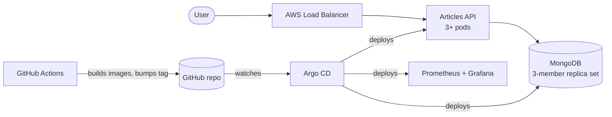

# Articles API on AWS EKS

A simple Articles REST API (FastAPI + MongoDB) deployed to AWS EKS the way a production service would be:

- **Terraform** builds the AWS infrastructure and the Kubernetes cluster
- **Helm** packages the app and the database
- **Argo CD** deploys them from this Git repo (GitOps)
- **No single point of failure**: everything runs 3× across 3 availability zones

✅ **Deployed and tested on a real AWS account (us-east-1).** See [Proof it works](#proof-it-works).

---

## 1. Architecture



| Component | What it does |
|---|---|
| **Articles API** | FastAPI app with create / list / read / update / delete on `/articles` |
| **MongoDB** | Stores the articles. 3 copies (one primary, two secondaries) in 3 different AZs |
| **AWS Load Balancer (ALB)** | Public entry point. Sends traffic to healthy API pods only |
| **Argo CD** | Keeps the cluster in sync with the `gitops/` folder in this repo |
| **Karpenter** | Adds EC2 nodes automatically when pods need more room, and removes them when idle |
| **Prometheus + Grafana** | Metrics, dashboards and alerts |
| **GitHub Actions** | Tests the code, builds the Docker images, and tells Argo CD about new versions |

**How a request flows:** User → ALB → one of the API pods → MongoDB primary.

**How a change gets deployed:** push to `main` → CI builds a new image → CI updates the image tag in `gitops/` → Argo CD rolls it out with zero downtime.

---

## 2. Prerequisites

| You need | Version |
|---|---|
| AWS account + IAM user/role that can create VPC, EKS, IAM, EC2 | — |
| An S3 bucket for Terraform state | — |
| Terraform | 1.10 or newer |
| AWS CLI | v2 |
| kubectl | 1.33 or newer |

> 💡 **Easiest option:** use **AWS CloudShell** (in the AWS console). It already has the AWS CLI, kubectl and your login, so you only need to install Terraform.

**Cost:** about **$0.50 per hour** while running. Remember to [tear it down](#tear-down).

---

## 3. Cluster setup (Terraform)

Terraform is split into two steps, because Kubernetes resources can only be created once the cluster exists:

| Step | Folder | Creates |
|---|---|---|
| **1. Cluster** | `terraform/environments/aws/1-cluster` | VPC across 3 AZs, EKS cluster, 3 worker nodes, Karpenter, Load Balancer Controller |
| **2. Platform** | `terraform/environments/aws/2-platform` | Namespaces, passwords (auto-generated), storage class, Argo CD |

**Option A: one command**

```bash
export TF_STATE_BUCKET=<your-s3-bucket>
./scripts/deploy-aws.sh
```

**Option B: step by step**

```bash
# Step 1: cluster (~17 min)
cd terraform/environments/aws/1-cluster
cp terraform.tfvars.example terraform.tfvars    # edit region / your IP if needed
terraform init
terraform apply

# connect kubectl to the new cluster
aws eks update-kubeconfig --name articles-eks --region us-east-1

# Step 2: platform (~4 min)
cd ../2-platform
terraform init
terraform apply
```

---

## 4. Application deployment (Helm + Argo CD)

You don't deploy the app by hand. Step 2 installs Argo CD, and Argo CD deploys everything from this repo:

| Order | App | Helm chart |
|---|---|---|
| 1 | Monitoring | `kube-prometheus-stack` (public chart) |
| 2 | MongoDB | `charts/mongodb` |
| 3 | Articles API | `charts/articles-api` |

Watch it happen (takes ~3 minutes):

```bash
kubectl -n argocd get applications
# wait until all show: Synced   Healthy
```

To open the Argo CD UI:

```bash
kubectl -n argocd port-forward svc/argocd-server 8081:80    # then open http://localhost:8081
kubectl -n argocd get secret argocd-initial-admin-secret -o jsonpath='{.data.password}' | base64 -d   # user: admin
```

---

## 5. Accessing the API

**Get the URL:**

```bash
kubectl -n articles get ingress articles-api
# copy the ADDRESS column, e.g. k8s-articles-xxxx.us-east-1.elb.amazonaws.com
```

**Run the full test** (create → list → read → update → delete):

```bash
./scripts/test-api.sh
```

**Or try it yourself:**

```bash
URL=http://<address-from-above>

# create
curl -X POST $URL/articles -H 'Content-Type: application/json' \
     -d '{"title":"Hello","content":"World","author":"me"}'

curl $URL/articles                  # list all
curl $URL/articles/<id>             # read one
curl -X PUT $URL/articles/<id> -H 'Content-Type: application/json' -d '{"title":"New title"}'   # update
curl -X DELETE $URL/articles/<id>   # delete
```

| Endpoint | Returns |
|---|---|
| `POST /articles` | 201 + the new article |
| `GET /articles` | 200 + list of articles |
| `GET /articles/{id}` | 200, or 404 if not found |
| `PUT /articles/{id}` | 200 + the updated article |
| `DELETE /articles/{id}` | 204 |

---

## Proof it works

Screenshots from the live EKS run. The full logs are in [`docs/evidence/`](docs/evidence), and a step-by-step write-up is in [`docs/eks-run.md`](docs/eks-run.md).

| What | Result |
|---|---|
| All CRUD operations through the load balancer | ✅ 201 → 200 → 200 → 200 → 204 → 404 |
| Pods spread across 3 availability zones | ✅ 1 API pod + 1 MongoDB pod in each AZ |
| Argo CD apps | ✅ All Synced / Healthy |
| MongoDB failover: deleted the primary during 60 s of writes | ✅ 111 of 111 writes succeeded, new primary in ~1 s |
| Karpenter autoscaling | ✅ New node ready in 34 s, removed when no longer needed |
| Time sync (NTP) on every node | ✅ Synced to Amazon Time Sync, offset in microseconds |

| | |
|---|---|
| CRUD (1/2) |  |
| CRUD (2/2) |  |
| Cluster, Argo CD, pods per AZ |  |
| MongoDB, Karpenter, Prometheus, NTP |  |
| MongoDB failover test |  |

---

## 6. Design decisions

**No single point of failure**

| If this fails… | …this keeps it running |
|---|---|
| An availability zone | Nodes, API pods and MongoDB members are spread over 3 AZs |
| An API pod | 2+ others keep serving; the load balancer only sends traffic to healthy pods |
| The MongoDB primary | A secondary is elected primary automatically (tested: ~1 s) |
| A node during maintenance | Disruption budgets stop Kubernetes from taking down too many pods at once |
| The Kubernetes control plane | Managed by AWS across 3 AZs |

**Key choices**

| Decision | Why |
|---|---|
| **EKS** | AWS runs the control plane; built-in load balancer, disk and IAM integration |
| **Two Terraform steps** | Kubernetes resources can't be planned before the cluster exists |
| **Plain Terraform resources (no modules)** | Everything is visible in one place and easy to review |
| **Argo CD (GitOps)** | Git is the single source of truth; manual changes in the cluster are reverted automatically |
| **Own MongoDB Helm chart** | Small and easy to explain; shows every HA piece clearly (an operator would be the next step) |
| **Karpenter** | Adds a right-sized node in seconds (can use cheaper spot instances) and removes idle ones |
| **Passwords generated by Terraform** | No secrets are ever stored in Git |
| **Liveness check doesn't test the DB** | A database blip shouldn't restart every API pod |

**Security in short:** containers run as non-root with a read-only filesystem, network policies limit who can talk to MongoDB, Kubernetes secrets are encrypted with AWS KMS, and no passwords or keys are stored in the code.

**Observability in short:** Prometheus collects API metrics (request rate, errors, latency) and MongoDB metrics. A Grafana dashboard and alert rules are included.

---

## Repository layout

```
app/            FastAPI application + tests
images/mongodb/ MongoDB image with replica-set setup script
charts/         Helm charts: articles-api, mongodb
gitops/         What Argo CD deploys (apps + values)
terraform/      AWS infrastructure (1-cluster, 2-platform)
scripts/        deploy, test, failover test, evidence, destroy
ansible/        NTP (chrony) setup for self-managed servers
docs/           Proof of the live EKS run
```

---

## Tear down

```bash
export TF_STATE_BUCKET=<your-s3-bucket>
./scripts/destroy-aws.sh
```

This deletes the load balancer, the Karpenter nodes, both Terraform steps, and the leftover disks, in the right order.

