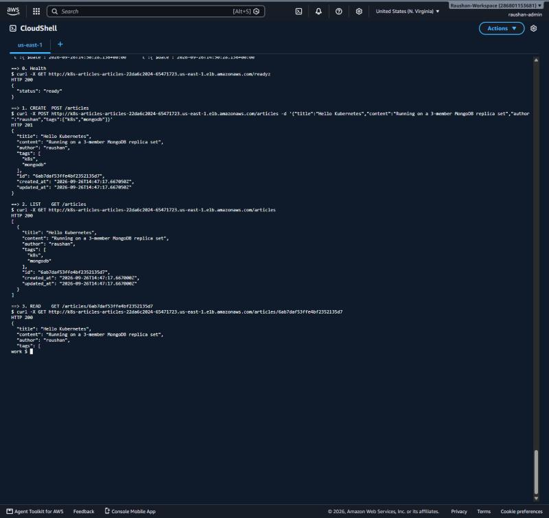
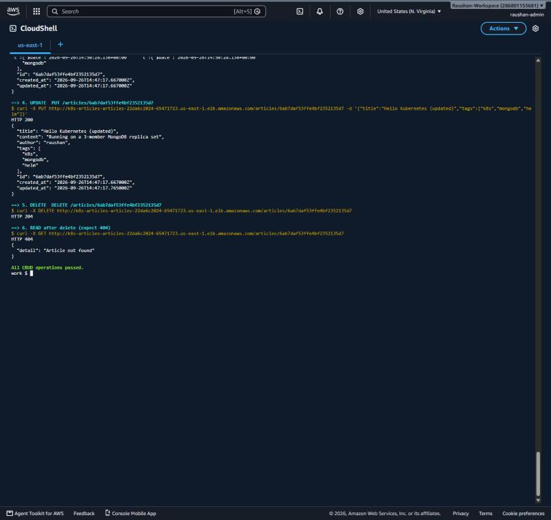
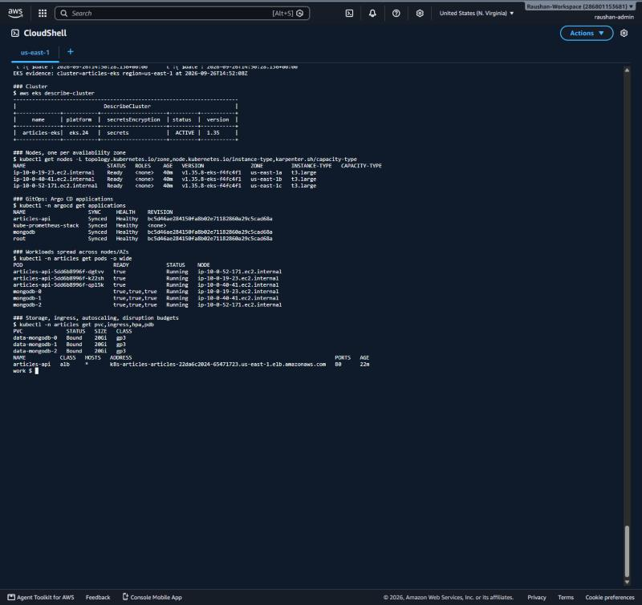
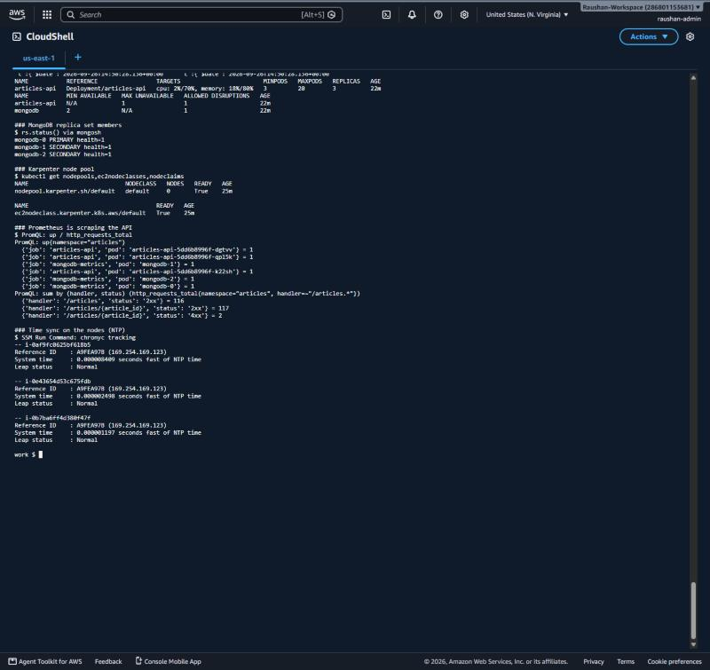
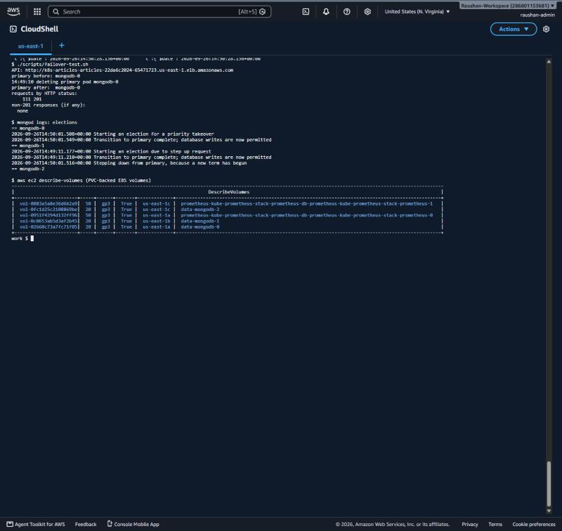

# EKS deployment run: 2026-09-26, us-east-1

The whole stack was deployed to a real AWS account from **AWS CloudShell** (console credentials, no access keys) and validated. Terraform state was kept in an encrypted S3 bucket with native lockfile locking.

## Timeline

| Time (UTC, ~ = approximate) | Step | Result |
|---|---|---|
| ~13:58 | `terraform plan`: `aws/1-cluster` | **74 to add**, 0 to change, 0 to destroy |
| ~13:59 → ~14:16 | `terraform apply`: `aws/1-cluster` | VPC across 3 AZs, EKS 1.35 (~10 min for the control plane), managed node group, 6 add-ons, Karpenter, AWS LB Controller, ECR. **Apply complete: 74 added** |
| ~14:16 | `aws eks update-kubeconfig` | 3 nodes Ready, one each in us-east-1a / 1b / 1c. LB Controller ×2, Karpenter ×2, EBS CSI, CoreDNS, metrics-server Running |
| ~14:26 → ~14:30 | `terraform plan/apply`: `aws/2-platform` | **15 added**: namespaces (PSA), generated secrets, gp3 StorageClass, Karpenter EC2NodeClass + NodePool, Argo CD (HA), root app |
| ~14:33 | Argo CD sync | `root`, `kube-prometheus-stack`, `mongodb`, `articles-api`: all **Synced / Healthy** |
| 14:33 | CRUD test through the ALB | readyz 200 → POST 201 → LIST 200 → GET 200 → PUT 200 → DELETE 204 → GET 404: **all CRUD operations passed** |
| 14:34 | Karpenter scale-out | 8 × 1-vCPU pending pods → **c6a.4xlarge** on-demand node in us-east-1a, Ready in **34 s** |
| ~14:40 | Karpenter consolidation | load deleted → node removed (`nodeclaims`: *No resources found*) |
| 14:47 | CRUD test (re-run for screenshots) | all passed ([text](evidence/eks-api-test.txt)) |
| 14:49 | MongoDB failover under load | primary pod deleted during 60 s of writes → **111/111 writes succeeded** ([text](evidence/eks-failover.txt)) |
| 14:52 | `scripts/collect-evidence.sh` | cluster, GitOps, placement, storage, HPA/PDB, replica set, Karpenter, Prometheus, NTP ([text](evidence/eks-cluster-state.txt)) |

## What was verified

| Requirement | Evidence |
|---|---|
| Cluster provisioned by Terraform | 74 + 15 resources from `terraform/environments/aws/{1-cluster,2-platform}`; EKS 1.35 ACTIVE, secrets encrypted with KMS |
| Worker nodes spread for HA | 3 × t3.large, one per AZ (us-east-1a/1b/1c) |
| API replicas, no SPOF | 3 API pods, one per AZ; HPA 3–20; PDB maxUnavailable 1; public ALB across 3 AZs |
| MongoDB replica set (3 members) | StatefulSet `mongodb-0/1/2`, one per AZ, each on its own encrypted 20 GiB gp3 EBS volume; `rs.status()` = PRIMARY + 2 SECONDARY; PDB minAvailable 2 |
| Failover | `mongodb-0` (primary) deleted at 14:49:10 → `mongodb-1` primary at 14:49:11.2 → `mongodb-0` back and re-elected by priority at 14:50:01; clients saw no errors |
| Helm + GitOps | 2 Helm charts deployed by Argo CD from `gitops/apps/aws` at git revision `bc5d46a` |
| CRUD through the load balancer | 201 / 200 / 200 / 200 / 204 / 404 |
| Autoscaling | Karpenter launched and later removed a node; HPA reporting cpu 2%/70%, memory 18%/80% |
| Observability | Prometheus `up` = 1 for 3 API pods + 3 MongoDB exporters; `http_requests_total` by route |
| NTP | `chronyc tracking` via SSM on every node: reference 169.254.169.123 (Amazon Time Sync), leap status Normal, offset 1–8 µs |

## Screenshots

| | |
|---|---|
| CRUD 1/2 |  |
| CRUD 2/2 |  |
| Cluster, Argo CD, pods per AZ |  |
| Replica set, Karpenter, Prometheus, NTP |  |
| Failover + EBS volumes |  |

## Lesson learned (worth mentioning in the interview)

The first `terraform plan` failed with *invalid provider configuration*. Layer 1 used the `kubectl` provider for the Karpenter NodePool/EC2NodeClass and the gp3 StorageClass, and a Kubernetes provider **cannot plan against a cluster that doesn't exist yet**. The fix was to move every Kubernetes object into layer 2 (`aws/2-platform`), which runs after the cluster exists. This is the reason for the two Terraform layers in the first place, and the plan then came out clean.

## Cost

About **$0.45–0.50 per hour** while running (EKS control plane, 3 × t3.large, 1 NAT gateway, 1 ALB, ~160 GiB gp3). `scripts/destroy-aws.sh` removes everything, including the ALB and the EBS volumes kept by the `Retain` policy.
