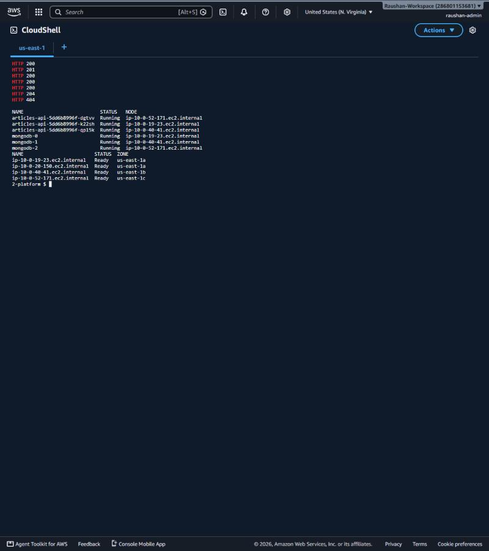

# EKS deployment run — 2026-09-26 (us-east-1)

The whole stack was deployed to a real AWS account from AWS CloudShell, validated, and then destroyed.

| Step | Result |
|---|---|
| `terraform apply` — `aws/1-cluster` | **74 added**: VPC across 3 AZs, EKS 1.35, managed node group, 6 add-ons, Karpenter, AWS LB Controller, ECR (about 17 min) |
| `terraform apply` — `aws/2-platform` | **15 added**: namespaces (PSA), generated secrets, gp3 StorageClass, Karpenter EC2NodeClass/NodePool, Argo CD and the root app (about 4 min) |
| Argo CD | `root`, `kube-prometheus-stack`, `mongodb`, `articles-api`: all **Synced / Healthy** about 3 min later |
| Placement | 3 API pods and 3 MongoDB members, **one per AZ** (us-east-1a/b/c), 3 × 20Gi encrypted gp3 PVCs |
| Public endpoint | ALB `k8s-articles-articles-…us-east-1.elb.amazonaws.com` created by the AWS Load Balancer Controller from the Ingress |
| CRUD test (`scripts/test-api.sh http://<alb>`) | readyz 200 → POST 201 → LIST 200 → GET 200 → PUT 200 → DELETE 204 → GET 404, so **all CRUD operations passed** |
| Karpenter | 8 × 1-CPU pending pods, so Karpenter launched a **c6a.4xlarge** (on-demand, us-east-1a) node in **34 s**; the node was consolidated away after the load was deleted |
| HPA / PDB | HPA cpu 2%/70%, memory 18%/80%; PDB `mongodb` minAvailable 2, `articles-api` maxUnavailable 1 |

## Lesson learned (worth mentioning in the interview)

The first `terraform plan` failed. `aws/1-cluster` used the `kubectl` provider for the Karpenter
NodeClass/NodePool and the gp3 StorageClass, and a Kubernetes provider **cannot plan against a cluster
that does not exist yet**. The fix was to move every Kubernetes object into layer 2 (`aws/2-platform`),
which runs after the cluster exists. That is the same reason the project is split into two Terraform
layers in the first place.

## Evidence



```
$ kubectl get nodes -L topology.kubernetes.io/zone
ip-10-0-19-23.ec2.internal    Ready   v1.35.8-eks   us-east-1a
ip-10-0-20-150.ec2.internal   Ready   v1.35.8-eks   us-east-1a   <- Karpenter (c6a.4xlarge)
ip-10-0-40-41.ec2.internal    Ready   v1.35.8-eks   us-east-1b
ip-10-0-52-171.ec2.internal   Ready   v1.35.8-eks   us-east-1c

$ kubectl -n argocd get applications
articles-api            Synced   Healthy
kube-prometheus-stack   Synced   Healthy
mongodb                 Synced   Healthy
root                    Synced   Healthy

$ kubectl -n articles get pods -o wide
articles-api-5dd6b8996f-dgtvv  Running  ip-10-0-52-171 (1c)
articles-api-5dd6b8996f-k22sh  Running  ip-10-0-19-23  (1a)
articles-api-5dd6b8996f-qpl5k  Running  ip-10-0-40-41  (1b)
mongodb-0                      Running  ip-10-0-19-23  (1a)
mongodb-1                      Running  ip-10-0-40-41  (1b)
mongodb-2                      Running  ip-10-0-52-171 (1c)
```
